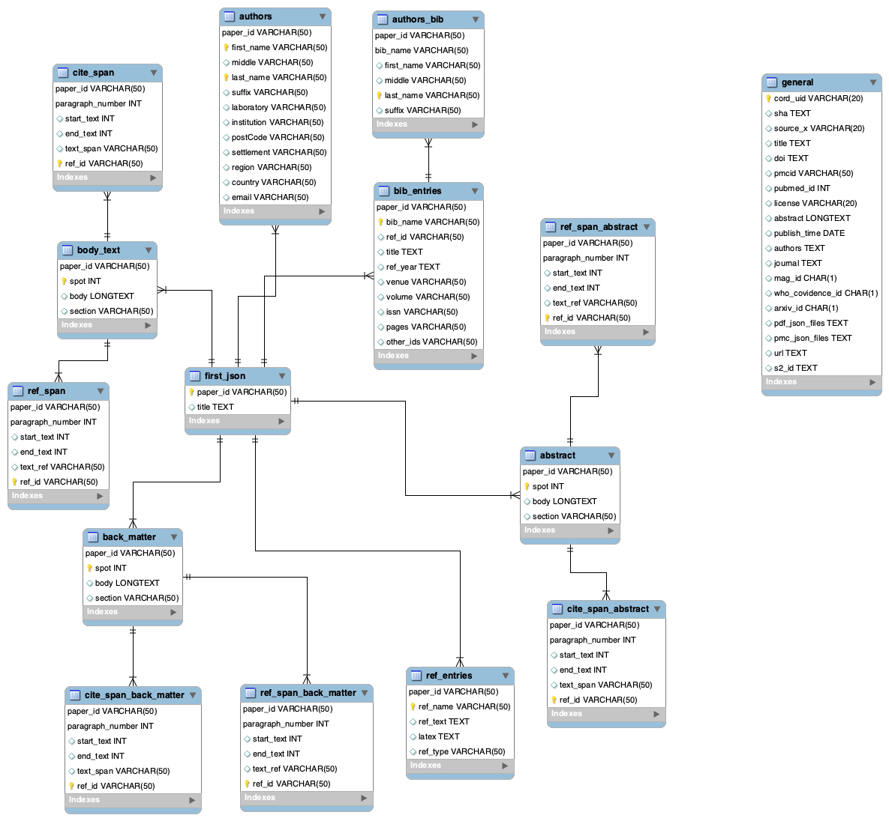

# Internet and Applications
For the needs of "Internet and Application" we will build o project that inserts articels into a relational database.
1. The articles our downloaded from: [www.semanticscholar.org](https://www.semanticscholar.org/cord19). 
2. We will create the Database ER-diagram and the Database with MySQLWorkbench and the program that will insert our data into our database.
3. We also created a program tha produces a bar diagram presenting the articles published per month, by "PLoS One" magazine.

## [Requirements](requirements.txt)

- mysql 8.0.19
- mysql_connector 2.2.9
- numpy 1.17.4
- pandas 0.25.3

## Installation
1. First of all we initialize a mysql database, in our project we used [MySQLWorkbenc](https://www.mysql.com/products/workbench/)
2. Then, connect to your database using your crendentials and run the following inside mysql command prompt:
   1. [create-tables.sql](database-configuration/create-tables.sql): to create the database.
   
### In the terminal

3. Run,

```bash
	$ git clone https://github.com/elenisproject/internet-and-applications.git
 $ cd internet-and-applications
```

4. Download from the articles from [www.semanticscholar.org](https://www.semanticscholar.org/cord19) and save them inside the /internet-and-applications/import-data folder.
5. Add your database credentials at the settings.py file,
```bash
 $ cd internet-and-applications/import-data/settings.py
```
6. Run the following strictly at this order,

```bash
	$ pip3 install -r requirements.txt
	$ python3 ./import-data/insert_metadata.py
 $ python3 ./import-data/insert_into_first_table.py
 $ python3 ./import-data/insert_authors.py
 $ python3 ./import-data/insert_text.py
 $ python3 ./import-data/insert_cite_span.py
 $ python3 ./import-data/insert_ref_span.py
 $ python3 ./import-data/abstract.py
 $ python3 ./import-data/cite_span_abstract.py
 $ python3 ./import-data/ref_span_abstract.py
 $ python3 ./import-data/back_matter.py
 $ python3 ./import-data/cite_span_back_matter.py
 $ python3 ./import-data/ref_span_back_matter.py
 $ python3 ./import-data/bib_entries.py
 $ python3 ./import-data/ref_entries.py
```

## Δομή αρχείων:
[database-configuration](https://github.com/elenisproject/internet-and-applications/tree/master/database-configuration):
this file contais the code to build our local database.<br />
Our Database hase 15 tables in total, one table for the metadata.csv file that has the general information for all the pdf_json files. <br />
While the other 14 tables are used to save all our data from the pdf_jason folder. <br />

**ER-Diagram** <br />
 
[import-data](https://github.com/elenisproject/internet-and-applications/tree/master/import%20data):
 
 - *settings.py:* contains the settings for connecting to our database.
 - *_.py:* is the code used to insert our data to a table, the file's name is the table's name we insert our data.
